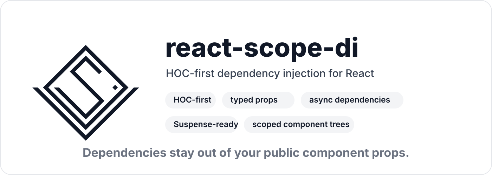
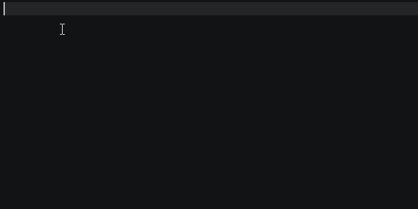

<p align="center">
    
</p>

HOC-first React dependency injection for `@svs-tm/scope-di`.

Use this package when you want React components to consume dependencies from a typed `scope-di` graph while keeping dependency injection outside the public component props.

The primary API is HOC-style resolution: `resolve()` and `resolveAsync()`. Hooks are available for corner cases, but they should be used under a stable scope boundary. Creating scopes, tools, or resolved components during render can cause repeated resolution and render loops.

- Keep dependencies out of public component props.
- Preserve typed dependency tuples at the renderer boundary.
- Resolve sync and async dependencies through stable component wrappers.
- Use local pending/error fallbacks per component.
- Create disposable child scopes for component subtrees.

```tsx
import { configureRootScope, DependencyLifetime } from "@svs-tm/scope-di";
import { createReactDiTools } from "@svs-tm/react-scope-di";

class UsersApi
{
    public async list()
    {
        return ["Ada", "Grace"];
    }
}

const scope = configureRootScope()
    .map("usersApi")
        .asClass(UsersApi, DependencyLifetime.Singleton)
    .map("title")
        .asValue("Users")
    .build();

export const di = createReactDiTools(scope);
```

## Install

```sh
pnpm add @svs-tm/scope-di @svs-tm/react-scope-di
```

```sh
npm install @svs-tm/scope-di @svs-tm/react-scope-di
```

```sh
yarn add @svs-tm/scope-di @svs-tm/react-scope-di
```

`@svs-tm/react-scope-di` supports React 18 and React 19.

## Compatibility

`@svs-tm/react-scope-di` supports TypeScript 5 and TypeScript 6. Compile-time public API tests run against the latest supported TypeScript 5.x and 6.x compiler versions.

## Why HOCs First

`resolve()` and `resolveAsync()` create stable component wrappers around dependency resolution. They own the scope boundary behavior, preserve public component props, handle local fallbacks, and avoid the common hook trap where scope construction changes during render.

That makes HOCs the recommended interface for normal application components.

| You want | Use |
| --- | --- |
| Inject sync dependencies into a component. | `resolve()` |
| Inject awaited async dependencies into a component. | `resolveAsync()` |
| Give a component its own child scope. | `createNewScope: true` in HOC options. |
| Reuse global and local error/pending UI. | HOC options. |
| Resolve dependencies inside a custom integration point. | Hooks, under a stable `DiScope`. |

## Quick Start

Create your root DI scope with `@svs-tm/scope-di`, create React tools from that scope, then use `resolve()` to build components.

```tsx
import { configureRootScope, DependencyLifetime } from "@svs-tm/scope-di";
import { createReactDiTools } from "@svs-tm/react-scope-di";

type Logger =
{
    info(message: string): void;
};

class ConsoleLogger implements Logger
{
    public info(message: string)
    {
        console.info(message);
    }
}

const scope = configureRootScope()
    .map("logger")
        .asClass<Logger>(ConsoleLogger, DependencyLifetime.Singleton)
    .map("appName")
        .asValue("Scope DI")
    .build();

const { DiScope, resolve, resolutionOptions } = createReactDiTools(scope);

type HeaderProps =
{
    readonly userId: string;
};

const Header = resolve
(
    ["appName", "logger"],
    resolutionOptions<HeaderProps>(),
    ({ props, dependencies: [appName, logger] }) =>
    {
        logger.info(`Rendering ${appName} for ${props.userId}`);

        return <h1>{appName}</h1>;
    }
);

export function App()
{
    return <Header userId="42" />;
}
```

`Header` only accepts `HeaderProps`. The caller does not pass `appName` or `logger`; those are resolved from the DI scope.

| HOC Props |
|---|


##

## Create React DI Tools

`createReactDiTools(scope)` returns a React API bound to your typed DI scope.

```ts
const {
    DiScope,
    resolve,
    resolveAsync,
    resolutionOptions,
    asyncResolutionOptions,
    DiAwait,
    useDependencies,
    useDependenciesAsync
} = createReactDiTools(scope);
```

| Tool | Purpose |
| --- | --- |
| `DiScope` | React provider for a DI scope boundary. |
| `resolve` | Recommended HOC-style helper for sync dependency injection. |
| `resolveAsync` | Recommended HOC-style helper for async dependency injection. |
| `resolutionOptions` | Helper for typed sync HOC options. |
| `asyncResolutionOptions` | Helper for typed async HOC options. |
| `DiAwait` | Suspense-aware helper for rendering async hook results. |
| `useDependencies` | Advanced hook for sync dependency resolution. |
| `useDependenciesAsync` | Advanced hook for async dependency resolution. |

## Sync Components

Use `resolve()` when dependencies are available synchronously or when you intentionally want to receive promise-valued dependencies as values.

```tsx
type UserBadgeProps =
{
    readonly userId: string;
};

const UserBadge = resolve
(
    ["logger", "title"],
    resolutionOptions<UserBadgeProps>(),
    ({ props, dependencies: [logger, title] }) =>
    {
        logger.info(`Rendering badge for ${props.userId}`);

        return <span>{title}</span>;
    }
);

<UserBadge userId="42" />;
```

The returned component preserves only the public props:

```tsx
<UserBadge userId="42" />;
```

Dependencies are inferred as a tuple in the same order as the keys.

## Async Components

Use `resolveAsync()` when dependencies should be awaited before rendering the component.

```tsx
const scope = configureRootScope()
    .map("profile")
        .asFactoryAsync
        (
            async () => ({ name: "Ada" }),
            DependencyLifetime.Singleton
        )
    .build();

const { DiScope, resolveAsync, asyncResolutionOptions } = createReactDiTools(scope);

type ProfileProps =
{
    readonly userId: string;
};

const Profile = resolveAsync
(
    ["profile"],
    asyncResolutionOptions<ProfileProps>
    (
        {
            pending: { node: <span>Loading profile...</span> },
            error: { component: ({ error }) => <span>Failed to load profile</span> }
        }
    ),
    ({ props, dependencies: [profile] }) =>
    {
        return <h2>{profile.name}</h2>;
    }
);

function ProfilePage()
{
    return <Profile userId="42" />;
}
```

`resolveAsync()` schedules async dependency work after React commits the render. This avoids starting async factories for discarded or uncommitted renders.

Generated HOC components receive display names based on the renderer, such as `DiResolve(HeaderRenderer)` and `DiResolveAsync(ProfileRenderer)`.

| Async HOC |
|---|


##

## Error And Pending Fallbacks

You can define global fallbacks when creating the tools.

```tsx
const di = createReactDiTools
(
    scope,
    {
        error: { component: ({ error }) => <span>Something went wrong</span> }
    }
);
```

You can override them locally for a specific resolved component.

```tsx
const Profile = di.resolveAsync
(
    ["profile"],
    di.asyncResolutionOptions
    (
        {
            pending: { node: <span>Loading...</span> },
            error: { component: ({ error }) => <span>Could not load profile</span> }
        }
    ),
    ({ dependencies: [profile] }) => <h2>{profile.name}</h2>
);
```

Local fallbacks take priority over global fallbacks.

## Component Scopes

`DiScope` creates a stable React scope boundary for resolved components in the subtree.

```tsx
function App()
{
    return (
        <DiScope>
            <Routes />
        </DiScope>
    );
}
```

For HOC-style components, pass `createNewScope: true` when a component should receive its own child DI scope.

```tsx
type RequestPanelProps =
{
    readonly requestId: string;
};

const RequestPanel = resolve
(
    ["requestState"],
    resolutionOptions<RequestPanelProps>
    (
        {
            createNewScope: true
        }
    ),
    ({ props, dependencies: [requestState] }) =>
    {
        return <section>{requestState.id}</section>;
    }
);
```

The child scope is disposed when the component unmounts. This is useful for scoped dependencies that should live exactly as long as that component subtree.

## Collections

Collection dependencies keep the same typed newest-to-oldest order as the core package.

```tsx
const scope = configureRootScope()
    .map("toolbarAction")
        .asValue("save")
    .map("toolbarAction")
        .asValue("refresh")
    .map("toolbarAction")
        .asValue("export")
    .build();

const { resolve, resolutionOptions } = createReactDiTools(scope);

const Toolbar = resolve
(
    [["toolbarAction"]],
    resolutionOptions(),
    ({ dependencies: [actions] }) =>
    {
        return (
            <div>
                {actions.map((action) => <button key={action}>{action}</button>)}
            </div>
        );
    }
);
```

## Hooks

Hooks exist for corner cases where an HOC does not fit: custom render integrations, very small local adapters, or code that needs direct access to dependency tuples.

Use hooks only under a stable `DiScope` boundary. Do not create a DI scope, call `createReactDiTools(scope)`, or create wrapper components inside a component render path. If the scope or resolved component identity changes every render, dependency resolution can repeatedly change component state and cause render loops.

### useDependencies

`useDependencies()` resolves dependencies synchronously and returns a typed tuple in key order.

```tsx
function UserBadge()
{
    const [logger, title] = useDependencies("logger", "title");

    logger.info("UserBadge rendered");

    return <span>{title}</span>;
}
```

| Hook resolution |
|---|


##

### useDependenciesAsync

`useDependenciesAsync()` resolves dependencies asynchronously and returns an async result that can be rendered with `DiAwait`.

```tsx
function Profile()
{
    const result = useDependenciesAsync("profile");

    return (
        <DiAwait result={result}>
        {
            ([profile]) => <h2>{profile.name}</h2>
        }
        </DiAwait>
    );
}
```

| Async Hook resolution |
|---|



##

Wrap async hook consumers with React `Suspense` when you want a loading UI.

```tsx
import { Suspense } from "react";

function ProfilePage()
{
    return (
        <DiScope>
            <Suspense fallback={<span>Loading profile...</span>}>
                <Profile />
            </Suspense>
        </DiScope>
    );
}
```

## Recommended Project Shape

Keep DI configuration outside components, then export resolved components or the DI tools your app uses.

```tsx
// di.ts
import { configureRootScope, DependencyLifetime } from "@svs-tm/scope-di";
import { createReactDiTools } from "@svs-tm/react-scope-di";

const scope = configureRootScope()
    .map("usersApi").asClass(UsersApi, DependencyLifetime.Singleton)
    .map("logger").asClass<Logger>(ConsoleLogger, DependencyLifetime.Singleton)
    .build();

export const {
    DiScope,
    resolve,
    resolveAsync,
    resolutionOptions,
    asyncResolutionOptions,
    DiAwait,
    useDependencies,
    useDependenciesAsync
} = createReactDiTools(scope);
```

```tsx
// app.tsx
import { DiScope } from "./di";
import { UsersPage } from "./users-page";

export function App()
{
    return (
        <DiScope>
            <UsersPage />
        </DiScope>
    );
}
```

This keeps component call sites clean while TypeScript carries the registered dependency graph through the resolved components.

## License

<p>
    <a href="./LICENSE"></a>
    <br />
    <a href="./LICENSE">MIT</a>
</p>
