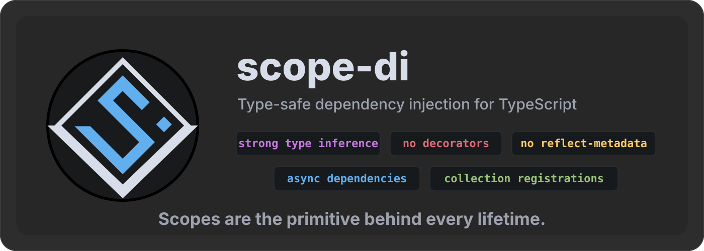

<p align="center">
    
</p>

Type-safe dependency injection for TypeScript without decorators or `reflect-metadata`.

- Typed resolution keys.
- Literal and abstraction-aware inference.
- Explicit dependency tuples.
- Scoped, inherited scoped, singleton, and transient lifetimes.
- Async dependency resolution.
- Collection registrations.
- No decorator setup or `tsconfig` metadata switches.

```ts
import { DependencyLifetime, configureRootScope } from "@svs-tm/scope-di";

type Logger =
{
    info(message: string): void;
};

class ConsoleLogger implements Logger
{
    public info(message: string)
    {
        console.info(message);
    }
}

const scope = configureRootScope()
    .map("logger").asClass<Logger>(ConsoleLogger, DependencyLifetime.Singleton)
    .map("serviceName").asValue("users")
    .build();

const [logger, serviceName] = scope.resolveRange("logger", "serviceName");
//     ^? Logger
//             ^? "users"

logger.info(`Starting ${serviceName}`);
```

## Why Choose It

Most TypeScript DI libraries optimize for decorator-based class wiring. That can be convenient, but it often means metadata emit, class scanning, or weaker types at the point where dependencies are resolved.

`@svs-tm/scope-di` is built for explicit, modern TypeScript:

| You want | What scope-di gives you |
| --- | --- |
| Type-safe resolution keys | Unknown keys fail at compile time. |
| Precise return types | Literal values, abstractions, tuples, collections, and awaited async dependencies are inferred. |
| No decorators or reflection | No `reflect-metadata`, emitted metadata, or class scanning. |
| Async dependency support | Async factories/classes are first-class and can be awaited through `resolveAsync()`. |
| Multiple dependencies under one key | Collection resolution is typed and ordered. |
| Real scope lifetimes | Singleton, scoped, inherited scoped, and transient dependencies. |
| Framework independence | The core package does not depend on any UI framework, decorators, or runtime metadata. |
| Small runtime dependency surface | The only runtime dependency is `@svs-tm/system`, which has no external runtime dependencies. |

## Install

```sh
pnpm add @svs-tm/scope-di
```

```sh
npm install @svs-tm/scope-di
```

```sh
yarn add @svs-tm/scope-di
```

## Quick Start

Register dependencies with `configureRootScope()`, then call `build()` to create a scope. Use `asDependent()` when a dependency needs other dependencies injected.

```ts
import { DependencyLifetime, configureRootScope } from "@svs-tm/scope-di";

type Logger =
{
    info(message: string): void;
};

class ConsoleLogger implements Logger
{
    public info(message: string)
    {
        console.info(message);
    }
}

class UsersService
{
    public constructor
    (
        private readonly logger: Logger,
        private readonly serviceName: string
    )
    {
    }

    public start()
    {
        this.logger.info(`Starting ${this.serviceName}`);
    }
}

const scope = configureRootScope()
    .map("logger").asClass<Logger>(ConsoleLogger, DependencyLifetime.Singleton)
    .map("serviceName").asValue("users")
    .map("usersService").asDependent("logger", "serviceName")
        .class(UsersService, DependencyLifetime.Singleton)
    .build();

const usersService = scope.resolve("usersService");

usersService.start();
```

| Typed Configuration |
|---|


##

### Values

`asValue()` registers an existing value. Literal types are preserved by default.

```ts
const scope = configureRootScope()
    .map("mode").asValue("production")
    .build();

const mode = scope.resolve("mode");
//    ^? "production"
```

When you want to register under a wider abstraction, pass a generic.

```ts
const scope = configureRootScope()
    .map("mode").asValue<string>("production")
    .build();

const mode = scope.resolve("mode");
//    ^? string
```

### Classes

```ts
class HttpClient
{
    public get(url: string)
    {
        return fetch(url);
    }
}

const scope = configureRootScope()
    .map("httpClient").asClass(HttpClient, DependencyLifetime.Singleton)
    .build();

const httpClient = scope.resolve("httpClient");
```

### Factories

```ts
const scope = configureRootScope()
    .map("createdAt").asFactory(() => new Date(), DependencyLifetime.Transient)
    .build();

const first = scope.resolve("createdAt");
const second = scope.resolve("createdAt");
```

### Dependent Dependencies

Use `asDependent()` when a class or factory needs other dependencies.

```ts
class UsersService
{
    public constructor
    (
        private readonly logger: Logger,
        private readonly httpClient: HttpClient
    )
    {
    }
}

const scope = configureRootScope()
    .map("logger").asClass<Logger>(ConsoleLogger, DependencyLifetime.Singleton)
    .map("httpClient").asClass(HttpClient, DependencyLifetime.Singleton)
    .map("usersService").asDependent("logger", "httpClient")
        .class(UsersService, DependencyLifetime.Scoped)
    .build();

const usersService = scope.resolve("usersService");
```

Factories get the same typed dependency parameters.

```ts
const scope = configureRootScope()
    .map("baseUrl").asValue("https://api.example.com")
    .map("httpClient").asClass(HttpClient, DependencyLifetime.Singleton)
    .map("usersApi").asDependent("baseUrl", "httpClient")
        .factory((baseUrl, httpClient) => ({ baseUrl, httpClient }), DependencyLifetime.Singleton)
    .build();

const usersApi = scope.resolve("usersApi");
```

| Dependent Factory Inference |
|---|


##

### Resolution

Use `resolve()` for one dependency.

```ts
const logger = scope.resolve("logger");
```

Use `resolveRange()` for a typed tuple of dependencies.

```ts
const [logger, httpClient, usersService] = scope.resolveRange
(
    "logger",
    "httpClient",
    "usersService"
);
```

Both APIs infer the result from the keys.

```ts
const values = scope.resolveRange("serviceName", "logger");
//    ^? ["users", Logger]
```

## Collections

Multiple registrations under the same key create a collection. Singular resolution returns the newest registration. Collection resolution uses `[key]` and returns all registrations from newest to oldest.

```ts
const scope = configureRootScope()
    .map("middleware").asValue("auth")
    .map("middleware").asValue("logging")
    .map("middleware").asValue("metrics")
    .build();

const latest = scope.resolve("middleware");
//    ^? "metrics"

const middleware = scope.resolve(["middleware"]);
//    ^? ["metrics", "logging", "auth"]
```

| Collections Inference |
|---|


##

Collections can be injected into dependent factories and classes.

```ts
const scope = configureRootScope()
    .map("processor").asValue("normalize")
    .map("processor").asValue("validate")
    .map("pipeline").asDependent(["processor"])
        .factory((processors) => processors, DependencyLifetime.Singleton)
    .build();

const pipeline = scope.resolve("pipeline");
```

## Async Dependencies

Async dependencies can be registered with `asFactoryAsync()` or `asClassAsync()`.

```ts
const scope = configureRootScope()
    .map("config")
        .asFactoryAsync
        (
            async () => ({ apiUrl: "https://api.example.com" }),
            DependencyLifetime.Singleton
        )
    .build();

const pendingConfig = scope.resolve("config");
//    ^? Promise<{ readonly apiUrl: "https://api.example.com" }>

const config = await scope.resolveAsync("config");
//    ^? { readonly apiUrl: "https://api.example.com" }
```

| Async Inference |
|---|


##

`resolve()` returns the raw runtime value. For async dependencies, that value is a promise. `resolveAsync()` awaits dependencies that were registered as async dependencies.

### Stored Promises

Sync dependencies are allowed to be promises too. In that case the promise is the dependency value, not async work that `scope-di` owns.

For singular `resolveAsync()` calls, `scope-di` boxes a sync promise dependency so JavaScript does not automatically unwrap it through native promise assimilation. The public box type is `BoxedPromiseDependency<TPromise>`.

```ts
import { configureRootScope } from "@svs-tm/scope-di";

const promiseValue = Promise.resolve("stored promise");

const scope = configureRootScope()
    .map("storedPromise")
        .asValue(promiseValue)
    .build();

const boxed = await scope.resolveAsync("storedPromise");
//    ^? BoxedPromiseDependency<Promise<string>>

boxed.promise === promiseValue;
```

Collection and range resolution already return arrays, so stored promises inside those arrays stay raw promise values.

```ts
const [storedPromise] = await scope.resolveRangeAsync("storedPromise");
//     ^? Promise<string>
```

| Sync promise Inference |
|---|


##

## Lifetimes

Scopes are the primitive behind every lifetime. A singleton is a dependency stored in the root scope. A scoped dependency is stored in the current scope. An inherited scoped dependency can reuse a value from a parent scope. A transient dependency is created for each resolution.

Every class or factory registration accepts a `DependencyLifetime`.

```ts
configureRootScope()
    .map("singleton")
        .asClass(Service, DependencyLifetime.Singleton)
    .map("scoped")
        .asClass(Service, DependencyLifetime.Scoped)
    .map("scopedInherited")
        .asClass(Service, DependencyLifetime.ScopedInherited)
    .map("transient")
        .asClass(Service, DependencyLifetime.Transient);
```

| Lifetime | Behavior |
| --- | --- |
| `Singleton` | One instance for the root scope. |
| `Scoped` | One instance per current scope. |
| `ScopedInherited` | Reuses an instance from the nearest parent scope when one exists, otherwise creates one in the current scope. |
| `Transient` | Creates a new instance on each resolution. |

## Scopes And Disposal

Scopes can create child scopes for request, job, component tree, or operation lifetimes.

```ts
const rootScope = configureRootScope()
    .map("requestId")
        .asFactory(() => crypto.randomUUID(), DependencyLifetime.Scoped)
    .build();

const requestScope = rootScope.createChildScope();

const requestId = requestScope.resolve("requestId");
```

Scopes implement `Disposable` and `AsyncDisposable`. Resolved dependencies that implement disposal contracts are disposed with the scope according to their lifetime.

```ts
class Connection implements Disposable
{
    public [Symbol.dispose]()
    {
        // Close the connection.
    }
}

const scope = configureRootScope()
    .map("connection")
        .asClass(Connection, DependencyLifetime.Scoped)
    .build();

scope.resolve("connection");
scope[Symbol.dispose]();
```

For async cleanup, use `await scope[Symbol.asyncDispose]()`.

## Snapshot Builders

`build()` creates a snapshot of the current mappings. Later builder changes do not mutate already built scopes.

```ts
const builder = configureRootScope()
    .map("a")
        .asValue("a");

const firstScope = builder.build();
const nextBuilder = builder
    .map("b")
        .asValue("b");
        
const secondScope = nextBuilder.build();

firstScope.resolve("a");
secondScope.resolve("b");
```

This keeps scope instances stable and predictable.

## Benchmarks

Performance comparison notes and result tables live in the [scope-di benchmark report](../core-benchmarks/README.md).

## License

<p>
    <a href="./LICENSE"></a>
    <br />
    <a href="./LICENSE">MIT</a>
</p>
